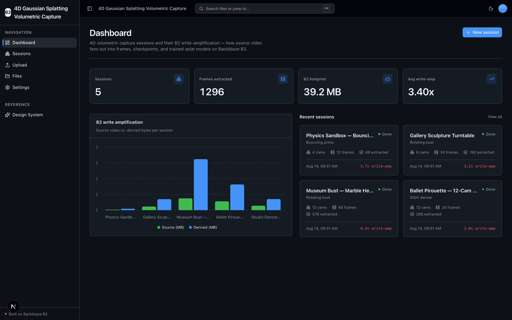
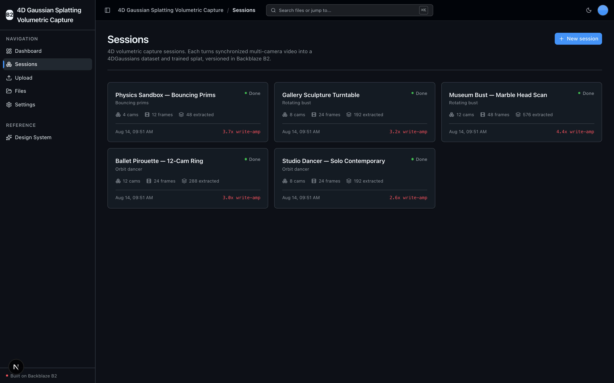
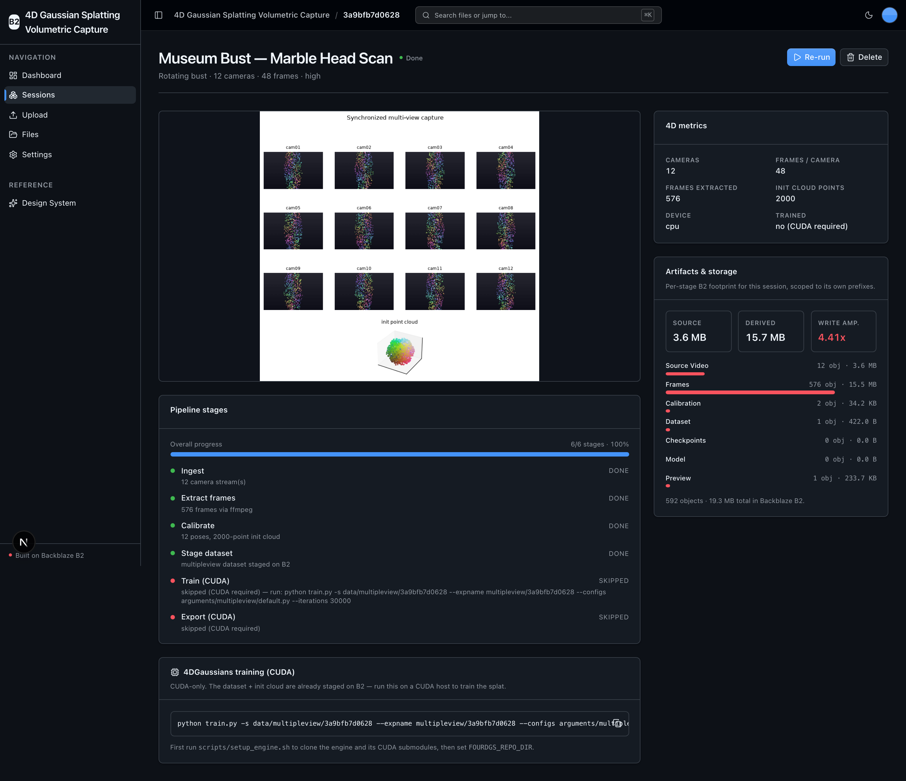
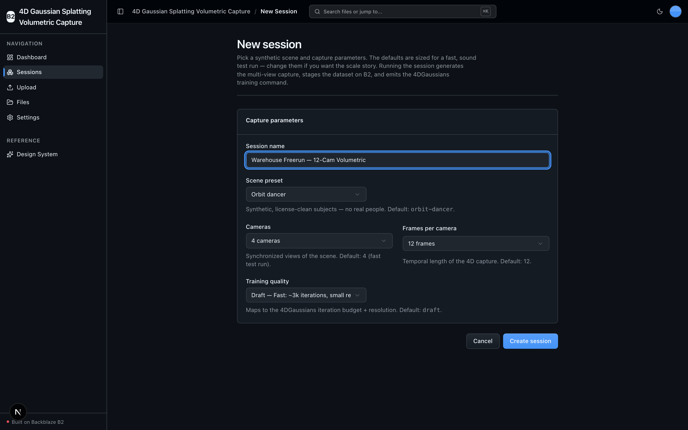

<!-- last_verified: 2026-08-13 -->
# 4D Gaussian Splatting Volumetric Capture

A capture-to-B2 pipeline for **dynamic 4D reconstruction**: turn synchronized multi-camera video of a moving scene into a [hustvl/4DGaussians](https://github.com/hustvl/4DGaussians) `multipleview` dataset and a trained, time-varying Gaussian-Splatting model — with every input and derived artifact versioned in **[Backblaze B2](https://www.backblaze.com/sign-up/ai-cloud-storage?utm_source=github&utm_medium=referral&utm_campaign=ai_artifacts&utm_content=b2ai-4d-gaussian-splatting-volumetric-capture)** over the S3-compatible API.

The headline story is **extreme data volume with write amplification**: one capture session fans out from source video → thousands of extracted frames → calibration + a sparse init point cloud → multi-GB training checkpoints → a final `.ply` splat model. Object storage that is cheap, durable, and S3-compatible is exactly what a volumetric-capture / VFX lab needs for that fan-out — and the whole pipeline runs on local OSS with **no second API key** (B2 credentials are the only secret).

**What you get out of the box:**
- A **Session** primary entity with a full UI lifecycle (create, browse, edit, delete, run) — its system of record is a JSON manifest in B2, no database.
- Synchronized **multi-view ingest**: upload per-camera video, or seed a fully synthetic capture; frames are extracted per camera with a bundled ffmpeg.
- A real **4DGaussians dataset staging** step (multipleview layout + init point cloud) and the exact `train.py` command for the CUDA training tail.
- A **B2 write-amplification dashboard** and a per-session **Artifacts / Storage** explorer that breaks the fan-out down by pipeline stage.
- The starter's full-bucket **File Explorer** and drag-and-drop **Upload**, kept intact.
- A layered FastAPI + Next.js shell (Tailwind v4, shadcn/ui) with structural tests and agent-first docs.

> **No GPU needed to try it.** The CPU-runnable stages — ingest, frame extraction, calibration, init cloud, dataset staging, previews, and *all* B2 I/O — run for real on any machine. Only 4D *training* needs CUDA; on a non-CUDA host that stage auto-gates and the app emits the exact command to run on a GPU box (see [4D training](docs/features/fourd-training.md)).

<!-- labs-project-page -->
Explore this sample on the [Backblaze Labs project page](https://backblazelabs.com/projects/4d-gaussian-splatting-volumetric-capture/).

## What it looks like

**Dashboard** — session stats, a per-session B2 write-amplification chart, and recent captures.



**Sessions** — every 4D capture session as a card with its scene, camera and frame counts, and write-amplification.



**Session detail** — a completed run: the synchronized multi-view contact sheet, 4D metrics, per-stage B2 storage breakdown, and the pipeline timeline with the CUDA training tail auto-gated on a non-GPU host.



**New session** — pick a synthetic scene and capture parameters (cameras, frames, training quality) before running the pipeline.



## Quick Start

You need: Node.js >= 20, pnpm >= 9, Python >= 3.12, and a free **[Backblaze B2 account](https://www.backblaze.com/sign-up/ai-cloud-storage?utm_source=github&utm_medium=referral&utm_campaign=ai_artifacts&utm_content=b2ai-4d-gaussian-splatting-volumetric-capture)**. A CUDA GPU is optional (only the 4D training tail uses it).

### Get the code

**Option 1: GitHub Template (recommended)** — click **"Use this template"** at the top of this repo, name your project, then:

```bash
git clone https://github.com/yourorg/my-capture-app.git
cd my-capture-app
```

**Option 2: Clone and reinitialize**

```bash
git clone https://github.com/backblaze-b2-samples/4d-gaussian-splatting-volumetric-capture.git my-capture-app
cd my-capture-app
rm -rf .git && git init && git add . && git commit -m "Initial commit"
```

### Setup

**1. Run setup**

```bash
pnpm run setup
```

This copies `.env.example` to `.env` (only when `.env` is missing), installs workspace dependencies from `pnpm-lock.yaml`, creates `services/api/.venv` if missing, validates that it uses Python 3.12+, and installs the API's committed Python 3.12 resolution from `services/api/requirements.lock`. It is safe to rerun and never overwrites an existing `.env`. Only the CPU-runnable base is installed here — the CUDA training engine is separate (see [Enabling 4D training](#enabling-4d-training-cuda)).

> Use the `pnpm run` form: `setup` (like `doctor`) is a built-in pnpm command before pnpm 11, so bare `pnpm setup` would run pnpm's own command instead of this script.

**2. Add your B2 credentials**

Open `.env` in your editor, then head to the [Backblaze B2 dashboard](https://secure.backblaze.com/b2_buckets.htm?utm_source=github&utm_medium=referral&utm_campaign=ai_artifacts&utm_content=b2ai-4d-gaussian-splatting-volumetric-capture) and:

1. **Create a bucket.** From the bucket, paste two values into `.env`:
   - **Bucket Unique Name** → `B2_BUCKET_NAME`
   - The **region slug** from the bucket's S3 **Endpoint** (e.g. `s3.us-east-005.backblazeb2.com` → `us-east-005`) → `B2_REGION`. The full S3 endpoint is derived from the region — there is no separate endpoint variable.
2. **Create an application key** with `Read and Write` permission. Paste two values into `.env`:
   - **keyID** → `B2_APPLICATION_KEY_ID`
   - **applicationKey** → `B2_APPLICATION_KEY` *(only shown once — paste it now)*

`B2_PUBLIC_URL_BASE` is optional (public buckets only) and the app runs without it.

> Want a walkthrough? See the docs for [creating a bucket](https://www.backblaze.com/docs/cloud-storage-create-and-manage-buckets) and [creating app keys](https://www.backblaze.com/docs/cloud-storage-create-and-manage-app-keys).

**3. Run it**

```bash
pnpm dev
```

Frontend at `localhost:3000`, API at `localhost:8000`. Create a session at `/sessions/new`, hit **Run**, and watch the pipeline stage a real multipleview dataset into your bucket. Interactive API docs (Swagger UI) are at `localhost:8000/docs`, ReDoc at `/redoc`.

`pnpm dev` runs the preflight check first — it catches the common setup gotchas (wrong Node/Python version, missing venv, missing or placeholder `.env`, ports already taken). Run it standalone any time with `pnpm run doctor`.

**Seed a synthetic demo (optional)**

```bash
python scripts/seed_demo.py
```

Renders a tiny, fully synthetic multi-camera capture (numpy + PIL — never real people, no downloaded dataset), uploads per-camera MP4s under `captures/<id>/`, and runs the real CPU pipeline end to end. It writes to your bucket, so it is **not** run by `pnpm verify`.

### Enabling 4D training (CUDA)

The 4DGaussians rasterizer and `simple-knn` are **CUDA-only** (no CPU/MPS kernels), so the engine ships out of the base install. On a CUDA host:

```bash
source services/api/.venv/bin/activate
FOURDGS_REPO_DIR=engines/4DGaussians bash scripts/setup_engine.sh
```

This clones [hustvl/4DGaussians](https://github.com/hustvl/4DGaussians), builds the two CUDA submodules, and prints the `FOURDGS_REPO_DIR` line to add to `.env`. The train/export stages then invoke the engine's `train.py` in an isolated subprocess and upload checkpoints + the final splat `.ply` to B2. On any non-CUDA host the stage is auto-gated and the trained splat is **never faked**.

### Supported local environments

Local scripts run on macOS, Linux, and WSL2 — native Windows isn't supported yet (the dev scripts use POSIX shell). Cloud or sandboxed agent environments also need permission to install dependencies and bind localhost ports; see [docs/dev-workflows.md](docs/dev-workflows.md) for sandbox, port-fallback, and IPv6 behavior.

## When to use

Use this repository when you are building a **dynamic 4D / volumetric-capture reconstruction pipeline** and want durable, cheap, S3-compatible object storage for the huge intermediate and final artifacts — source video, extracted frames, calibration, checkpoints, and the trained splat model. It is a working, engineering-minded scaffold (strict architecture, contract checks, tests, deployment runbooks) that an AI coding agent can read and extend, not a blank prototype.

## When not to use

Do not choose this repository expecting a complete hosted SaaS product or a managed 4D-reconstruction service. It does not provide managed hosting, user accounts, authentication, tenant isolation, billing, or on-call operations, and it does not bundle GPU compute. Before running an adapted application in production, you own its product-specific security, operations, capacity, compliance, and support decisions.

## Why Backblaze B2?

[Backblaze B2](https://www.backblaze.com/cloud-storage?utm_source=github&utm_medium=referral&utm_campaign=ai_artifacts&utm_content=b2ai-4d-gaussian-splatting-volumetric-capture) is the object storage this pipeline is built around — a deliberate default, not just a demo backend:

- **S3-compatible API.** B2 speaks the S3 API, so the `boto3` calls and tooling you already use for AWS S3 work unchanged — you just point them at B2's endpoint. This project uses the S3-compatible API throughout (isolated in `services/api/app/repo/`), so nothing is locked to a proprietary client.
- **Built for the fan-out.** A single 4D session explodes into thousands of frames and multi-GB checkpoints. B2 storage runs at a fraction of hyperscaler pricing with generous free egress — what you want when reconstruction artifacts pile up and a rendering client needs to pull the finished model straight from storage.
- **Free to start.** A [free B2 account](https://www.backblaze.com/sign-up/ai-cloud-storage?utm_source=github&utm_medium=referral&utm_campaign=ai_artifacts&utm_content=b2ai-4d-gaussian-splatting-volumetric-capture) is enough to run everything in this repo.

## Building Your App

The starter's reusable scaffolding is kept, and the domain-specific screens are the ones you extend:

- **Keep** the UI kit (`apps/web/src/components/ui/` + design tokens in `globals.css` + `/design`).
- **Keep** the full-bucket File Explorer (`/files`) and Upload (`/upload`) pages and their sidebar entries — they're the reusable B2-backed surface.
- **Extend** the Sessions domain (`/sessions`, `services/api/app/{types,repo,service,runtime}` session modules) for your own capture parameters, calibration source, or export formats.
- **Rebrand** by editing a single file: `apps/web/src/lib/app-config.ts` holds `APP_NAME` and `APP_DESCRIPTION`; the FastAPI title derives from it too, so the page title, sidebar, breadcrumb, and API identity update everywhere.

Full contract and rationale: [AGENTS.md](AGENTS.md).

## Agent-First Architecture

This repo is optimized for coding agents. **[AGENTS.md](AGENTS.md) is the single source of truth** — a bounded entry point with the repository layout, architectural invariants, commands, and pointers to deeper docs. Agent-specific files (CLAUDE.md, GEMINI.md, Copilot instructions) are thin pointers back to it.

Architecture is enforced **mechanically, not by convention**: the layered backend (`types → config → repo → service → runtime`), the boto3-only-in-`repo/` boundary, per-file size limits, and the OpenAPI/client contract are all verified by structural tests and lints on every change.

## Core Features

- [Sessions & lifecycle](docs/features/sessions.md) — create / browse / edit / delete / run 4D capture sessions; manifest-in-B2, no database
- [Multi-view ingest](docs/features/multiview-ingest.md) — per-camera video upload (or a synthetic seed), frames extracted with a bundled ffmpeg
- [4D training](docs/features/fourd-training.md) — the 4DGaussians engine, its CUDA gating, and the exact `train.py` command
- [Write amplification](docs/features/write-amplification.md) — the dashboard and the per-session storage explorer
- [File Browser](docs/features/file-browser.md) — full-bucket list, preview, download, delete (kept from the starter)
- [File Upload](docs/features/file-upload.md) — drag-and-drop presigned upload direct to B2 (kept from the starter)
- [Design System](docs/design-system.md) — tokens, primitives, error/empty states. Live preview at `/design`.
- Single-source config — one `.env` at the repo root powers both API and web app, validated at startup so misconfig fails fast.
- Checked local API contract — [`docs/api/openapi.json`](docs/api/openapi.json) plus `pnpm contract:check` catch FastAPI/client route drift.
- Structured JSON logging, `/health` (B2 connectivity), `/metrics` (Prometheus), per-IP rate limiting.

## Tech Stack

- TypeScript, Next.js 16, React 19, Tailwind v4, shadcn/ui, Recharts, TanStack Query
- Python 3.12+, FastAPI, boto3, Pydantic v2, NumPy, Pillow, imageio-ffmpeg, plyfile, matplotlib
- **hustvl/4DGaussians** (local, keyless) for the CUDA 4D training tail
- Backblaze B2 (S3-compatible object storage)
- pnpm workspaces (monorepo)

## Commands

| Command | What it does |
|---------|-------------|
| `pnpm run setup` | One-time cold start: copy `.env.example` → `.env` (if missing), install deps, create the venv, install locked API deps |
| `pnpm dev` | Start frontend + backend (runs the `pnpm run doctor` preflight first) |
| `pnpm verify` | Credential-free pre-PR suite — runs `check:agent-docs`, `verify:api`, then `verify:web` |
| `pnpm verify:full` | `pnpm verify` plus Playwright E2E; needs a live local stack, real `.env`, free port 3000, and Chromium |
| `pnpm contract:export` / `pnpm contract:check` | Export / verify the FastAPI OpenAPI contract in `docs/api/openapi.json` |

`pnpm verify` is the gate to run before opening a PR. It needs `services/api/.venv` from `pnpm run setup`, but no B2 credentials or browser, and it breaks down into `pnpm verify:api` (backend lint, tests, structure), `pnpm verify:web` (frontend lint, unit tests, typecheck + build), and `pnpm check:agent-docs` (agent-doc drift).

For the full command reference (`dev:web`, `dev:api`, `lint`, `test:*`, `check:structure`, `test:e2e`, live B2 tests), plus worktree/parallel-run notes and port-fallback behavior, see [docs/dev-workflows.md](docs/dev-workflows.md).

## Deploying to Vercel

Deploys as **one Vercel project** — the Next.js web app and FastAPI API build from the same repo and share one origin (web at `/`, API under `/api`), so there's **no CORS and no second URL to wire up**. Note that the CUDA training tail does not run on Vercel serverless; a deploy exercises the CPU pipeline (staging + all B2 I/O), and training runs on your own CUDA host.

[](https://vercel.com/new/clone?repository-url=https%3A%2F%2Fgithub.com%2Fbackblaze-b2-samples%2F4d-gaussian-splatting-volumetric-capture&project-name=4d-gaussian-splatting-volumetric-capture&repository-name=4d-gaussian-splatting-volumetric-capture&demo-title=4D%20Gaussian%20Splatting%20Volumetric%20Capture&demo-description=Turn%20synchronized%20multi-camera%20video%20into%20a%204DGaussians%20dataset%20and%20trained%20volumetric%20splat%2C%20versioned%20in%20Backblaze%20B2.&demo-image=https%3A%2F%2Fraw.githubusercontent.com%2Fbackblaze-b2-samples%2F4d-gaussian-splatting-volumetric-capture%2Fmain%2Fdocs%2Fimages%2Fdashboard.png&env=B2_APPLICATION_KEY_ID,B2_APPLICATION_KEY,B2_BUCKET_NAME,B2_REGION&envDescription=B2%20credentials%2C%20bucket%2C%20and%20region&envLink=https%3A%2F%2Fgithub.com%2Fbackblaze-b2-samples%2F4d-gaussian-splatting-volumetric-capture%2Fblob%2Fmain%2Finfra%2Fvercel%2FREADME.md)

Uploads go **directly from the browser to B2** (presigned PUT), so Vercel's 4.5 MB payload limit doesn't apply. Two things to know before a real deploy:

- Your bucket's CORS must allow the deploy origin (run `services/api/scripts/setup_b2_cors.py`).
- The deployed API is unauthenticated and bucket-wide — use a dedicated B2 bucket/prefix and key for any preview.

Full setup — variable reference, the two-Projects alternative, security, and rollback — is in the [Vercel delivery contract](infra/vercel/README.md).

## Documentation Map

| Doc | Purpose |
|-----|---------|
| [AGENTS.md](AGENTS.md) | Agent table of contents — start here |
| [ARCHITECTURE.md](ARCHITECTURE.md) | System layout, layering, data flows, prefix layout |
| [docs/features/](docs/features/) | Feature docs (sessions, multi-view ingest, 4D training, write amplification, explorer, upload) |
| [docs/design-system.md](docs/design-system.md) | Design tokens, primitives, error/empty states |
| [docs/app-workflows.md](docs/app-workflows.md) | User journeys |
| [docs/dev-workflows.md](docs/dev-workflows.md) | Engineering workflows and testing |
| [docs/SECURITY.md](docs/SECURITY.md) | Security principles |
| [docs/RELIABILITY.md](docs/RELIABILITY.md) | Reliability expectations |
| [docs/api/openapi.json](docs/api/openapi.json) | Checked contract for the template's local FastAPI API |
| [infra/vercel/README.md](infra/vercel/README.md) | Vercel deployment contract |
| [docs/exec-plans/](docs/exec-plans/) | Execution plans and tech debt tracker |

## FAQ

**What is 4D Gaussian Splatting Volumetric Capture?**
An open-source, full-stack template (Next.js 16 + FastAPI) that turns synchronized multi-camera video of a moving scene into a [hustvl/4DGaussians](https://github.com/hustvl/4DGaussians) `multipleview` dataset and a trained, time-varying splat model, with every input and derived artifact versioned in [Backblaze B2](https://www.backblaze.com/cloud-storage?utm_source=github&utm_medium=referral&utm_campaign=ai_artifacts&utm_content=b2ai-4d-gaussian-splatting-volumetric-capture). The primary entity is a **Session** whose record is a JSON manifest in B2 — there is no database.

**Do I need a GPU?**
No, not to try it. The CPU-runnable stages (ingest, frame extraction, calibration, init cloud, dataset staging, previews, and all B2 I/O) run for real everywhere. Only 4D *training* needs CUDA; on a non-CUDA host that stage auto-gates and the app emits the exact `train.py` command to run on a GPU box. The trained splat is never faked or simulated.

**Which engine does it use?**
[hustvl/4DGaussians](https://github.com/hustvl/4DGaussians) — dynamic 4D reconstruction with a temporal deformation field. It is local and keyless, so B2 credentials are the only secret; there is no second API key.

**Is it free?**
Yes. The code is MIT-licensed (see [License](#license)), and Backblaze B2 offers a free account to get started. The default synthetic demo keeps the B2 footprint tiny.

**Are the demo assets real people?**
No. The seed and screenshots use fully procedural synthetic renders (numpy + PIL). No downloaded academic/research datasets are bundled.

**Do I have to use Backblaze B2?**
It integrates B2 through the S3-compatible API, and B2 is the storage the pipeline is built around. You supply your own B2 bucket and application key during setup.

**Can I use it in production?**
It's a template/sample Backblaze maintains to help developers build 4D/volumetric pipelines on B2. Production use is possible with caution and requires your own validation — you own the product-specific security, operations, capacity, compliance, and support decisions. See [When not to use](#when-not-to-use) and [Maintenance and support](#maintenance-and-support).

**How do I deploy it?**
It deploys to Vercel as a single project (web + API, one origin). A Railway path is also documented. Deploying is always a human-approved action — see [Deploying to Vercel](#deploying-to-vercel).

**Does it work on Windows?**
Local scripts are supported on macOS, Linux, and WSL2. Native Windows is not supported yet — use WSL2.

**Where do I get help or report bugs?**
Report repository defects and feature requests through [GitHub Issues](https://github.com/backblaze-b2-samples/4d-gaussian-splatting-volumetric-capture/issues). For B2 account, billing, service, or API help, use [Backblaze Support](https://www.backblaze.com/help).

## Maintenance and support

Backblaze maintains this open-source template/sample to help developers build 4D/volumetric-capture pipelines on B2. Production use is possible with caution and requires your own validation. Report repository defects and feature requests through [GitHub Issues](https://github.com/backblaze-b2-samples/4d-gaussian-splatting-volumetric-capture/issues); for B2 account, billing, service, or API help, use [Backblaze Support](https://www.backblaze.com/help). This template/sample is not covered by the Backblaze service level agreement, and no SLA is provided for the repository software; any B2 service or support commitments are governed separately by the applicable Backblaze terms and support plan.

## Contributing

Start with [AGENTS.md](AGENTS.md). It's the map — everything else is discoverable from there. For local commit hooks, follow [the pre-commit workflow](docs/dev-workflows.md#pre-commit).

## License

MIT License - see [LICENSE](LICENSE) for details.

## Related projects

**Claude Agent B2 Skill** — manage Backblaze B2 from your terminal using natural language (list/search, audits, stale or large file detection, security checks, safe cleanup). Repo: [claude-skill-b2-cloud-storage](https://github.com/backblaze-b2-samples/claude-skill-b2-cloud-storage).
